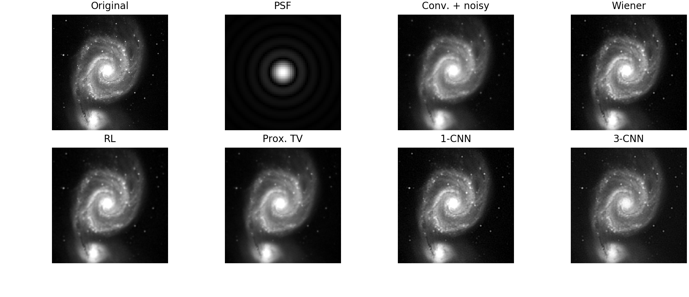

# AstroImageReconsCNN
Astronomical Image Reconstruction with Convolutional Neural Networks



This repository contains the code used for the numerical experiments of the foillowing paper:


R. Flamary, "[Astronomical image reconstruction with convolutional neural networks](https://arxiv.org/pdf/1612.04526.pdf)", European Conference on Signal Processing (EUSIPCO), 2017.


The code is under MIT Licence but please refer to and cite the above paper if you use it for academic purposes.

Note that the code is not yet available due to necessary cleanup but feel free to send me an email if you cannot wait for the GitHub version.

##  Dependencies

In order to run, the code requires the following Python modules:

* Numpy/Scipy and Matplotlib
* Scikit-image
* Keras and Theano
* Astropy

You can also use the Tensorflow backend in keras but I used the theano backend to save the models provided int his repository.

If you have not already installed them you can install the dependencies with PIP usng the following command

```
$ pip install numpy scipy matplotlib keras theano astropy
```


## Plot results and run simulations

### Reproduce all plots

Numerical experiments results are available in the res directory to reproduce
all  Figures and Table in the paper.

* **visu_images_all.py**: Plot Figure 2 in the paper (show dataset).
* **visu_images_rec.py**: Plot Figure 3 in the paper (reconstruction on M51a).  
* **visu_filters_deconv.py**: Plot Figure 4 in the paper (intermediate CNN filters).
* **visu_comp_perfs.py** : Print Table 1.

### Reproduce all results (numerical computation)

Numerical experiments can be reproduced in 2 steps:
* Learn all the the CNN (saves models in models/).
* Run all reconstruction algorithms (saves results in res/ in matlab format).

To do that you should run the following scripts:

* **run_cnn_all.py** : Run the training for all images with the CNN.
* **run__linearcnn_all.py** : Run the training for all images with the CNN with one linear layer.
* **run_deconv_all.py** : Run the deconvolution for the method given in the first parameter of the command line (from 'none', 'wiener', 'rl', 'vc_tv', 'cnn', 'cnn0').
